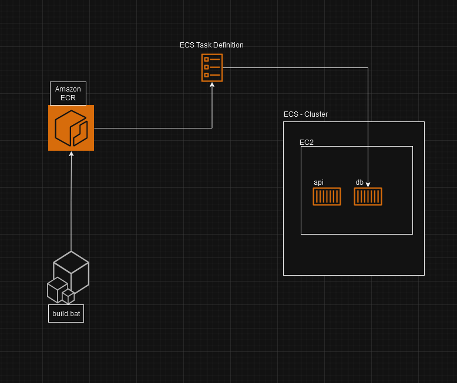

# Tech-Challenge-fase3  
## Repositório para o Tech Challenge - Grupo 30
Este repositório contém o código-fonte e a documentação para o Tech Challenge - Fase 3, desenvolvido pelo Grupo 30.

O projeto consiste em uma API RESTful para gerenciamento de estacionamento. A API permite criar um usuário, fazer checkin e checkout de um veículo estacionado, e realizar o pagamento por Cartão ou Pix.

## 1- Relatório Técnico
Tecnologias e ferramentas utilizadas

* Linguagem de programação: 

    * Java 17

* Framework:
    * Spring Boot 3.1.3

* Bibliotecas:
  * Spring Web
  * Spring Mail
  * Spring Job Runner
  * OpenAPI
  * IText Core
  * Lombok
* Banco de dados:
  * PostgreSQL
* Outras ferramentas:
  * Docker 

## Configurações da solução

### Banco de Dados
Configuração de teste utilizando o H2:
https://github.com/rcsim/tech-challenge-fase3/blob/e6cc39c83eccb9eca2657d5cf7ed8c54938d04d9/src/main/resources/application-test.properties#L1-L5

Configuração de produção utilizando o PostgreSQL
https://github.com/rcsim/tech-challenge-fase3/blob/e6cc39c83eccb9eca2657d5cf7ed8c54938d04d9/src/main/resources/application-dev.properties#L1-L7

Relacionamento entre as entidades:

### Container

Criamos um container para aplicação e outro para o banco de dados e uma rede no modo bridge para ter acesso ao containers via localhost:

https://github.com/rcsim/tech-challenge-fase3/blob/e6cc39c83eccb9eca2657d5cf7ed8c54938d04d9/docker-compose.yml#L1-L33

Também adicionamos o arquivo Dockerfile que gerencia o processo de build da aplicação através do Maven e JDK, já inicializando a aplicação:

https://github.com/rcsim/tech-challenge-fase3/blob/e6cc39c83eccb9eca2657d5cf7ed8c54938d04d9/Dockerfile#L1-L15

Para criação dos container, compilar e rodar a applicação é necessário apenas o comando:

docker-compose up -d

### Documentação das APIS 
Adicionamos a geração automática da documentação através da biblioteca SpringDoc OpenAPI, a documentação pode ser acessada enquanto a aplicação estiver rodando em http://localhost:8080/swagger-ui/index.html#/:

#### Arquivo POSTMAN

Disponibilizamos um arquivo JSON com todas as requisições Postman para testar a API, disponível no seguinte link:

https://github.com/rcsim/tech-challenge-fase3/blob/main/src/main/resources/postman/Tech-challenge-3.postman_collection.json

### Envio de notificações

Conforme solicitado no documento de requisitos, implementamos o envio de notificações nos seguintes casos:

1- Envio de notificação 30 minutes antes do encerramento do período fixo contratado ou 30 minutos antes de completar a próxima hora:

2- Envio do recibo ao final do período, seja após o checkout pelo usuário ou ao completar o período fixo já pago.

Também é enviado ao usuário o recibo em formato de pdf:

## Deploy AWS

Elaboramos um arquivo "build.bat" com o propósito de facilitar o processo de implantação das imagens Docker no Amazon Elastic Container Registry (ECR). Ao ajustar os parâmetros neste arquivo, você pode provisionar tanto o contêiner da aplicação quanto o do banco de dados. 
Para orquestrar a execução desses contêineres no cluster ECS que foi criado, configuramos uma definição de tarefa (task definition). Além disso, montamos um ambiente ECS baseado em infraestrutura EC2, fornecendo instâncias que serão encarregadas de executar os contêineres. 
Estas instâncias são fundamentais para a operação e funcionamento adequado de nossas aplicações e este conjunto de ações garante uma estrutura sólida e escalável para a execução de seus contêineres Docker no ambiente AWS.

Evidencias em fotos na pasta: [Aws](https://github.com/rcsim/tech-challenge-fase3/tree/f7f62a1d549c66ecc3e184b7f2dc0faa039f5f44/src/main/resources/Aws)

## Conclusões 

O projeto foi desenvolvido com sucesso, atendendo aos requisitos do desafio. As tecnologias e ferramentas utilizadas foram adequadas para o propósito do projeto e contribuíram para o desenvolvimento eficiente e robusto do sistema.

Principais dificuldades encontradas foram relacionadas ao deploy na AWS, entre elas a dificuldade de selecionar o melhor serviço para atender ao requisito do aumento exponencial da demana em períodos específicos do ano e a escolher recursos gratuitos visto que este não é um projeto comercial.
Além disso, dedicamos tempo no entendimento das regras de negócio do projeto, que por serem complexas exigiram um entendimento cuidadoso dos mesmos.

Outro problema enfrentado se refere ao envio de email utilizando um serviço gratuito fornecido por uma empresa terceira. Esse serviço tem uma performance abaixo do esperado, quando utilizado no plano gratuito, (5 segundos por requisição de envio) o que poderia comprometer o requisito de performance solicitado. Para resolver este problema utilizamos duas  bibliotecas (Job Runner e Spring Scheduller) para fazer o scheduling das requisições de envio de email.
